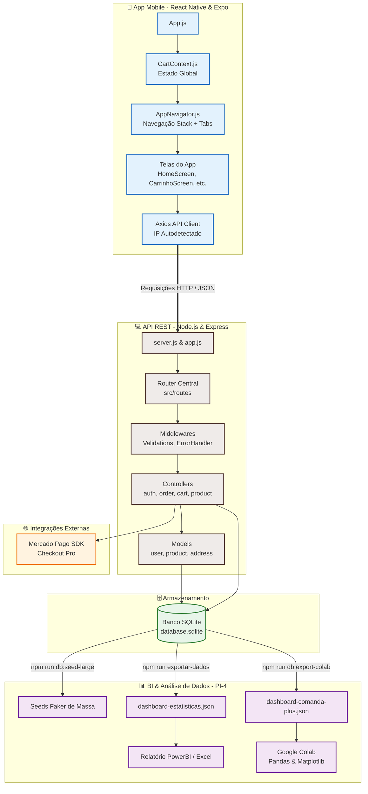

# 🍽️ Portal Comanda+ — Ecossistema Integrado

<p align="center">
  
</p>

> **Comanda+** é uma solução full stack completa de autoatendimento, pedidos e cardápio digital projetada no modelo de marketplace de alimentação (estilo iFood simplificado). A aplicação foi concebida sob rigorosos padrões de Engenharia de Software como entrega prática da disciplina **Projeto Integrador do 4º Semestre (PI-4)**.

---

## 📂 Documentações Específicas

Para facilitar a leitura, o teste de rotas, a configuração de variáveis de ambiente e a compilação do código nativo, **a documentação técnica do ecossistema foi descentralizada**. 

Escolha o subsistema que deseja explorar:

| Componente | Conteúdo da Documentação | Link de Acesso |
| :--- | :--- | :---: |
| **💻 API REST Backend** | Configuração do SQLite, Testes de Integração Jest, modelagem relacional do banco, documentação tabular dos Endpoints e exportações analíticas (BI / Google Colab). | 👉 **[Documentação do Backend](./backend/README.md)** |
| **📱 Aplicativo Mobile** | Inicialização do Expo, automação inteligente de detecção de IP de rede local, simulação em navegador web, arquitetura de navegação (Context API) e componentes. | 👉 **[Documentação do Mobile](./mobile/README.md)** |

---

## 📐 Arquitetura do Sistema & Fluxo de Dados

O ecossistema Comanda+ funciona sob uma arquitetura de cliente-servidor distribuída, integrando persistência relacional local, automações de inteligência de negócios (BI), modelagem estatística em Python e gateways externos de pagamentos digitais:



---

## 🛠️ Tecnologias Chaves Unificadas

*   **Frontend Mobile**: React Native (`0.81.5`), Expo SDK (`~54.0.34`), React Navigation (`^6.x`/`^7.x`), Axios (`^1.6.8`).
*   **Backend & APIs**: Node.js (`18+`), Express (`^4.18.3`), dotenv, cors.
*   **Persistência de Dados**: SQLite (`sqlite3 ^5.1.7`) com Promises.
*   **Segurança**: Criptografia Hash bcryptjs (`^3.0.3`) e express-validator (`^7.3.2`).
*   **Gateway de Pagamento**: SDK do Checkout Pro do Mercado Pago (`^2.12.0`).
*   **Suíte de Testes**: Jest (`^29.7.0`) & Supertest (`^7.0.0`).
*   **BI & Data Science**: Python (Pandas/Matplotlib/Seaborn) & Google Colab.

---

## 📂 Estrutura Simplificada de Pastas

```text
📦 comanda-plus/
│
├── 📁 backend/                  → API REST desenvolvida em Node.js com SQLite (Servidor)
│   ├── 📁 src/                  → Controladores, modelos, esquemas de validação e rotas
│   ├── 📁 scripts/              → Utilitários faker de vendas e exportação de relatórios
│   ├── 📁 __tests__/            → Testes de rotas HTTP escritos em Jest & Supertest
│   └── server.js                → Inicializador básico do servidor HTTP Express
│
├── 📁 mobile/                   → Aplicativo multiplataforma em React Native & Expo (Cliente)
│   ├── 📁 src/                  → Telas, navegação (Tab/Stack), Hooks, estilos e serviços
│   ├── 📁 scripts/              → Script de autodetector de IP privado local da máquina
│   └── App.js                   → Inicializador mestre de componentes e contextos do Expo
│
├── .gitignore
└── README.md                    → Este portal centralizador do projeto
```

---

## 🌿 Versionamento e Fluxo Git (GitFlow Simplificado)

Para um controle rigoroso de entregas, o repositório mantém branches com funções bem isoladas:
*   `main`: Versão perfeitamente testada e homologada da aplicação (pronta para submissão e avaliação final).
*   `develop`: Ramificação integradora para junção de novas features de desenvolvimento.
*   `feature/*`: Ramos locais criados individualmente para construção de telas ou rotas da API.

---

## 🎓 Requisitos Atendidos do Projeto Integrador (PI)

1.  **Operações CRUD Completas**: Atendido em 100%. Demonstrado funcionalmente no painel de **Meus Endereços** do usuário e persistido com integridade no banco de dados SQLite através do backend.
2.  **Consumo de APIs RESTful**: Atendido em 100%. Sincronização em tempo real das chamadas assíncronas do cliente **Axios** no aplicativo mobile mapeadas diretamente contra os controladores Express da API.
3.  **Exportação Analítica para Tomada de Decisão**: Atendido em 100%. Rotinas automatizadas de seeds densos faker de vendas históricas e geradores de relatórios JSON planos prontos para importação analítica direta no **Microsoft PowerBI / Excel** e modelagens estatísticas no **Python (Pandas / Google Colab)**.

---

## 👥 Equipe Comanda+

Desenvolvido para fins de avaliação acadêmica no **Projeto Integrador 4º Semestre (PI-4)**.
